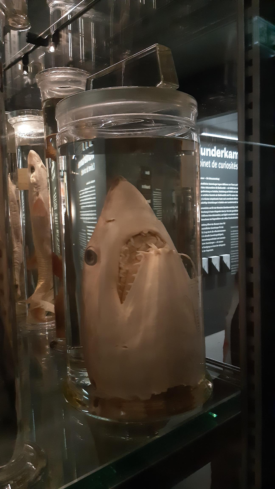
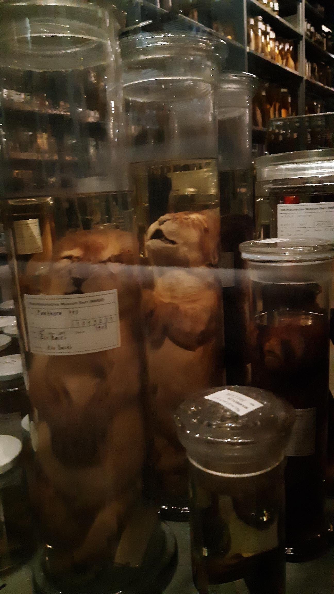

+++
title = "Einmachgläser "
date = "2023-03-20"
draft = false
pinned = false
tags = ["NaturhistorischesMuseumBern"]
description = "Wunderkammer - Die Schausammlung"
+++
#### Die schweizer Tierwelt im Glas

Wie steht es um die Schweizer Fische? Was sind ihre Eigenheiten? Und wann gibt es wo die frischesten Fische zu fischen? Lukas Rüber (Kurator Ichthyologie NMBE) und Thomas Schläppi (Biologe und passionierter Fischer) tauchen mit den Teilnehmenden ein in die wundersame Unterwasserwelt. Für alle, die ihr Fischwissen vertiefen oder auffrischen möchten.

In wissenschaftlichen Sammlungen lagern Millionen von Tieren und Pflanzen. Diese wertvollen Archive der Natur dokumentieren die Biodiversität – die Vielfalt des Lebens – und ermöglichen die Grundlagenforschung zur Evolution, Verbreitung und Vielfalt von Lebewesen. Auch weiterführende Arbeiten zur vertieften Kenntnis der Biodiversität sind für unsere Gesellschaft von unschätzbarem Wert: So könnten beispielsweise heute noch unentdeckte Wirkstoffe und Materialien aus der Natur für zukünftige Entwicklungen in Medizin oder Landwirtschaft bahnbrechend sein.

Doch die unersetzliche und für den Menschen überlebenswichtige Vielfalt des Lebens ist gefährdet, und ihre Erforschung ist heute dringender denn je: Von den geschätzten 10 Millionen Arten sind erst etwa 2.1 Millionen Arten dokumentiert, und täglich verschwinden unzählige für immer, zusammen mit ihren Lebensräumen wie Regenwäldern oder wilden Flusslandschaften.

 

> **Mit der Ausstellung öffnet das Museum einen Teil seiner wissenschaftlichen Sammlungen für das Publikum.** 

Ein Gang durch die «Wunderkammer» gibt Einblick in aktuelle Sammlungstätigkeit, moderne Untersuchungsmethoden und unersetzliche historische Sammlungen – ein aussergewöhnlicher Rundgang zu einem der drängendsten Probleme der Gegenwart.

