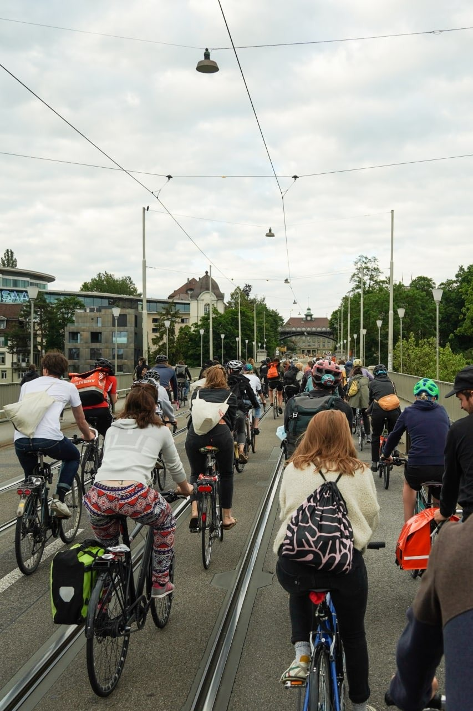
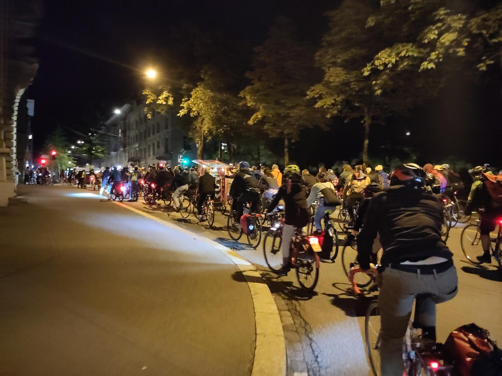

+++
title = "Um dem motorisierten Verkehr auf Augenhöhe zu begegnen – Critical Mass"
date = "2023-05-09"
draft = false
pinned = false
image = "signal-2023-05-07-094844_008.jpeg"
description = "Eine Velofahrt als Gruppe durch die Stadt, was ist das? Die Critical Mass, was sie schon bewirkt hat und wie sie funktioniert."
+++


Eine Velofahrt als Gruppe durch die Stadt, was ist das? Die Critical Mass, was sie schon bewirkt hat und wie sie funktioniert.



Geschrieben von Rahel Heigl

Es ist der 25. Februar – der letzte Freitag im Monat. Es ist dunkel und man sieht flackernde Lichter. Auf der Strasse sind noch viele Autos unterwegs, obwohl es schon 19.00 Uhr ist. Die Arbeiter\*innen kommen alle erst jetzt von der Arbeit nach Hause. An der Ecke ist eine Ampel. Die Autos müssen warten. Die Ampel an der linken Seite wird grün und es kommen eins, zwei, drei Velos. Nein! Vier, fünf, sechs. Immer mehr. Die Autofahrer\*innen finden sich in einem Meer von Velos wieder. Man hört ganz verschiedene Klingeln. Und plötzlich ein: «HALLO! VELO!». Niemand weiss, was passiert. Die Ampel wird grün, aber die Autos können nicht durchfahren. Es kommen immer mehr Velos, und man sieht kein Ende. Doch dann, fünfzig Sekunden später, der Lichtblick für die Autofahrer*innen, schon ist alles vorbei. Die Autos können weiter Richtung zuhause fahren.

Einen Tag später, konnte man in den Sozialen Medien lesen, dass dies die Critical Mass war.

Was ist die Critical Mass überhaupt? Die Critical Mass (CM) ist eine Veranstaltung, an der sich viele Velofahrer*innen treffen, um durch die Stadt zu fahren. Das Ziel ist es, eine «Kritische Masse» zu erreichen, «so dass dem motorisierten Verkehr auf Augenhöhe begegnet werden kann», wie dies die [Internetseite der Critical Mass in Zürich](https://criticalmass-zh.ch/was-ist-die-critical-mass.html) formuliert.

- - -



##### *Entstehung und Namensgebung der Critical Mass*

Die erste Critical Mass fand im September 1992 in San Francisco statt. Seit dem Start der ersten Critical Mass treffen sich Velofahrer\*innen weltweit meist monatlich für eine gemeinsame Fahrt in verschiedenen Städten. Eine CM hat keine Organisator\*innen. Das heisst, wenn irgendeine Person eine Critical Mass organisieren möchte, muss sie nur den Ort und die Zeit durch soziale Medien, Plakate, Mundpropaganda oder sonst irgendwie bekannt geben. Wenn dann zur angegebenen Zeit am geplanten Ort Velofahrer\*innen eintreffen, findet die CM statt und die Velofahrer\*innen beginnen ohne einen genauen Plan durch die Stadt zu fahren.

Der Film «Return of the Scorcher» (1992) von Ted White war ausschlaggebend für den Namen «Critical Mass». In dem Film geht es um die Fahrradkultur in China und den Niederlanden im Vergleich zu den USA. George Bliss, der im Film vorkommt, beobachtete das Verkehrsverhalten in China. Die Verkehrsteilnehmenden überquerten problemlos eine Kreuzung ohne Ampel, nachdem sie durch das Warten bis zu einer bestimmten Gruppengrösse eine «kritische Masse» erreicht hatten, um den Gegenverkehr zum Anhalten zu zwingen. Diese «kritische Masse» war ausschlaggebend für den Namen Critical Mass.



- - -

Als Velofahrer*in setzt man sich täglich im Strassenverkehr vielen Gefahren aus. Durch die CM kann man den öffentlichen Raum als Gruppe vorübergehend zurückerobern. Jedoch ist sie keine Demonstration. Tim, ein Aktivist und Mitfahrer der CM formuliert dies im Interview so: «Ich sage jetzt mal, es ist keine Demonstration, da es quasi einfach eine Zusammenkunft von vielen Leuten, vielen Menschen ist, die dann gemeinsam Fahrradfahren, wie auch Autos gemeinsam fahren».

Dazu kommt auch noch, dass die CM nach aussen keine politische Botschaft oder Nachricht hat. Es sei wirklich nur ein Zusammenkommen, das rechtlich gesehen keine Demonstration sei. Auch die Polizei denkt, es sei keine Demonstration, da sie noch keine Mitfahrenden verhaftet haben und nur eingreifen, wenn zum Beispiel jemand respektlos auf dem Velo fahre. Dieser Meinung ist auch Herr Meyer von Bernmobil. Herr Meyer sagt, eine CM entspreche für Bernmobil nicht einer eigentlichen Demonstration, «jedoch behandeln wir die CM mit dem gleichen Mechanismus wie eine unbewilligte Demonstration.»

- - -

> ***«Natürlich hat die CM schon eine gewisse politische Meinung»***

Die Critical Mass ist keine Demonstration, jedoch hat sie schon eine gewisse politische Meinung. Da niemand mit Schildern mitfahre, gäbe es rechtlich gesehen keinen Grund zur Annahme, dass sie eine Demonstration sei, wie dies Tim sagt. Somit besteht für ihn auch keine Diskussion darüber, ob man eine Bewilligung für die Critical Mass einführen sollte. Wenn es eine Bewilligung gäbe, wie [Përparim Avdili, FDP-Präsident der Stadt Zürich, vom Zürcher Stadtrat fordert](https://www.watson.ch/schweiz/interview/322657143-critical-mass-das-grosse-streitgespraech-zwischen-fdp-und-sp), würde man die CM als Demonstration ansehen.

Für Bernmobil wäre eine Bewilligung von Vorteil und begrüssenswert, da es ihnen so mehr Planungssicherheit gäbe. Herr Meyer erzählt: «Wir können natürlich dann entsprechend Dispositionen treffen, damit die Fahrgäste eben möglichst wenig betroffen sind von Umleitungen oder Unterbrüchen.» Dadurch, dass die Critical Mass ein Fahren durch die Stadt ist, wird der Verkehr zu einem Teil eingeschränkt. Tim sagt, es werde sehr darauf geachtet, aktiv den Verkehr nicht sonderlich einzuschränken. Bei einer CM bewegen sich die Velos als eine Einheit, als ein Fahrzeug fort. Das heisst, bei einer Ampel, wenn es für die ersten Velos noch grün ist, fahren diese weiter. Alle anderen folgen den Vorderen, auch wenn die Ampel rot werden würde. So, dass sie wie zum Beispiel bei einem Lastwagen, eine Einheit bleiben. Dies hat zur Folge, dass Autos oder allgemein Motorfahrzeuge zum Teil etwas im Stau stehen. Doch in der Innenstadt müssen Autos allerdings sowieso mit Verzögerungen rechnen.

- - -

Was immer wieder ein Problem werden kann, ist, wenn der ÖV oder ein Blaulicht-Fahrzeug durch das Meer von Velofahrer*innen hindurch muss. Die Mitfahrenden in der «Kritischen Masse» versuchen, alle Blaulicht-Fahrzeuge durchzulassen. Es ist nicht immer ganz einfach durchzuführen, aber, wie Tim sagt, sei er jetzt auch schon ein paarmal dabei gewesen, als ein Krankenwagen durch musste. Und das sei dann doch jedes Mal irgendwie recht schnell gegangen. Da die CM im Moment hier in Bern relativ klein sei, hat auch der ÖV, solange sie nicht grösser werde, keine grossen Probleme, so äussert sich Herr Meyer.

Bei der Frage, was die Critical Mass schon erreicht habe, meint Tim im Interview, dass es darauf ankomme, von welcher Stadt man spräche. Hier in Bern kann man nicht sagen, dass die CM dies oder das schon erreicht hat, da die Veloinfrastruktur, wie Tim es ausdrückt, «schon einigermassen ‘umä’ ist». Er denkt auch, dass die CM schon eher ins Unterbewusstsein der Menschen eingedrungen ist, spezifisch bei Politiker*innen, so dass man unbewusst schon oft ans Fahrrad denkt. So sei Tim der Meinung, dass zum Beispiel bei Entscheidungsprozessen wie bei einem Strassenbauprojekt automatisch das Fahrrad schon von Anfang an eingebunden werde.

- - -

> ***«Als Fahrradfahrer*in in Zürich ist es brutal.»**

In Zürich ist die Veloinfrastruktur um einiges schlechter. Das sieht man auch an der Grösse der CM, die dort deutlich grösser ist. Tim sagt, es sei «brutal», dort mit dem Velo zu fahren. Er denkt, dass darum dort auch leichter handfeste Auswirkungen durch die Critical Mass erreicht werden können. Dort gibt es zu Gunsten der Velofahrer*innen mehr politischen Druck, was den Ansporn zusätzlich steigert.

Für Orte und Städte, die schon eine «einigermassen gute» Infrastruktur für Velos haben, wird die CM kaum eine noch bessere Infrastruktur erreichen. Sondern eher indirekt, eine schlechtere Infrastruktur für Motofahrzeuge, was den Velofahrer*innen wieder zugutekommen würde. Dies würde vielleicht auch irgendwann zu einer autofreien Innenstadt führen. Eine solche Situation würde natürlich sowohl von Bernmobil, solange diese mit dem ÖV noch fahren dürfen, als auch von Tim von Herzen begrüsst werden.

«Stelle dir einmal die Lorraine-Brücke ohne Autos vor. Man könnte dort ganz verschiedene Sachen pflanzen und Stände aufstellen», erzählt Tim schwärmend. Die Lebensqualität würde deutlich erhöht werden. Herr Meyer denkt, sowohl der Anreiz, den ÖV vermehrt zu benutzen als auch die Belebung der Innenstadt wären ein Vorteil, wenn die Stadt Bern autofrei werden würde. Somit würde er auch, so wie er das Interview abgeschlossen hat, gerne mal bei einer Critical Mass dabei sein und mitfahren.

> ***«Ja, ich würde gerne mal mitfahren!»***

